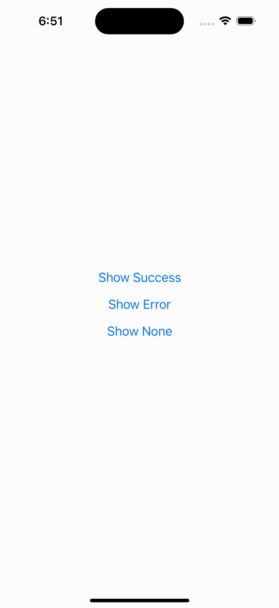

# Smooth Push

A smooth, gesture-based toast notification component for React Native.



## Features

- 🎨 Beautiful, minimal design with translucent effect
- 👆 Gesture support (swipe to dismiss)
- 🎯 Highly customizable
- 💫 Smooth animations
- 📱 iOS and Android support
- 🌓 Light/Dark mode compatible

## Installation

```bash
npm install smooth-push
```

### Required Dependencies

This package requires the following peer dependencies:

```bash
npm install react-native-reanimated react-native-gesture-handler
```

## Setup

### 1. Configure Reanimated

Add Reanimated's Babel plugin to your `babel.config.js`:

```js
plugins: [
  'react-native-reanimated/plugin',
],
```

### 2. Wrap Your App with GestureHandlerRootView and import SmoothPushProvider

In your app's root component (usually `App.js` or `_layout.tsx`), wrap your entire app with `GestureHandlerRootView`:

```js
import { GestureHandlerRootView } from "react-native-gesture-handler";
import { SmoothPushProvider } from "smooth-push";

export default function App() {
  return (
    <GestureHandlerRootView style={{ flex: 1 }}>
      <SmoothPushProvider />
      {/* Your app components go here */}
    </GestureHandlerRootView>
  );
}
```

### 3. Use SmoothPushProvider in Your App

Now you can use the `show` function to display toast notifications:

```js
import { show } from "smooth-push";
// Basic usage
show({
  toastType: "success",
  message: "Operation completed successfully",
});
// With custom configuration
show({
  toastType: "error",
  message: "Something went wrong",
  config: {
    duration: 3000,
    position: "bottom",
    offset: 40,
  },
});
```

## Configuration

You can customize the toast notifications in two ways:

1. Default configuration through the `SmoothPushProvider`
2. Per-notification configuration when calling `show()`

### Provider Configuration

```js
<SmoothPushProvider
  defaultConfig={{
    duration: 5000,
    position: "top",
    offset: 60,
    maxWidth: 400,
    blurIntensity: 50,
    containerStyle: {},
    textStyle: {},
    onPress: () => {},
    onClose: () => {},
  }}
/>
```

### Available Options

| Property       | Type              | Default   | Description                                  |
| -------------- | ----------------- | --------- | -------------------------------------------- |
| duration       | number            | 6000      | Duration in milliseconds before auto-dismiss |
| position       | 'top' \| 'bottom' | 'top'     | Toast position on screen                     |
| offset         | number            | 60        | Distance from top/bottom edge                |
| maxWidth       | number            | 400       | Maximum width of toast                       |
| blurIntensity  | number            | 50        | Intensity of blur effect                     |
| containerStyle | ViewStyle         | {}        | Custom styles for container                  |
| textStyle      | TextStyle         | {}        | Custom styles for text                       |
| onPress        | () => void        | undefined | Callback when toast is pressed               |
| onClose        | () => void        | undefined | Callback when toast is dismissed             |
| swipeThreshold | number            | -55       | Threshold for swipe to dismiss               |
| stickColor     | string            | "#ffcad4" | Color of the bottom indicator stick         |

## Types

```ts
type SmoothPushType = "success" | "error" | "none";

interface NotificationConfig {
  duration?: number;
  position?: "top" | "bottom";
  offset?: number;
  maxWidth?: number;
  blurIntensity?: number;
  containerStyle?: ViewStyle;
  textStyle?: TextStyle;
  onPress?: () => void;
  onClose?: () => void;
  swipeThreshold?: number;
  stickColor?: string;
}

interface ShowNotification {
  toastType: SmoothPushType;
  message: string;
  config?: NotificationConfig;
}
```

## License

MIT

## Contributing

Contributions are welcome! Please feel free to submit a Pull Request.
